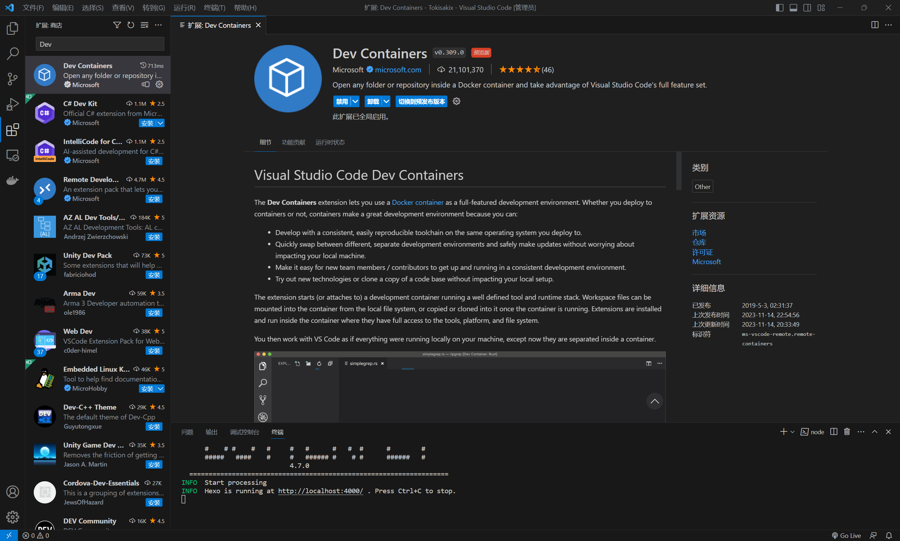
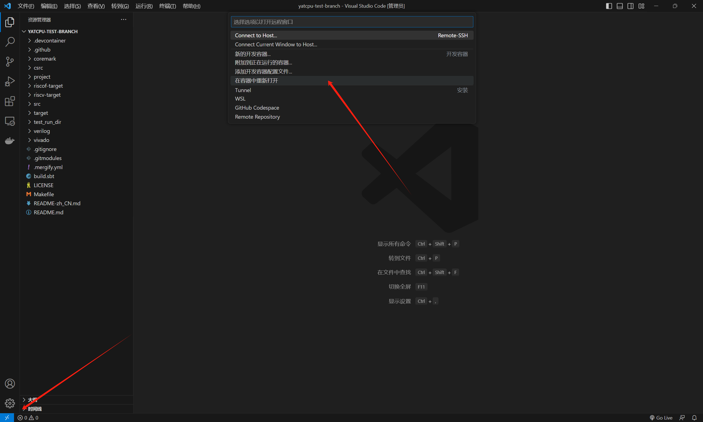
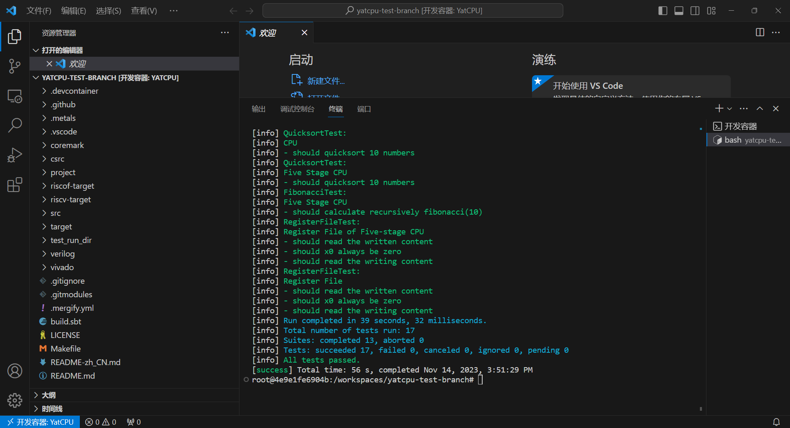
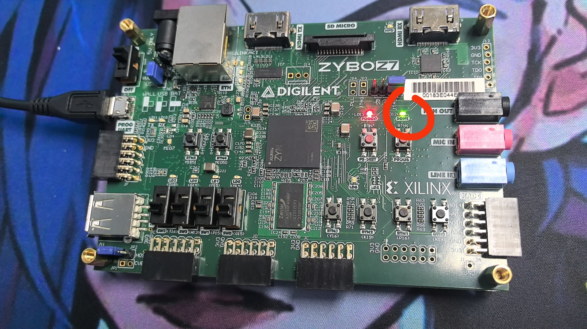

# YatCPU

本仓库由 [Tokisakix](https://github.com/Tokisakix)、[PurplePower](https://github.com/PurplePower)、[Han Huang](https://github.com/HHTheBest) 在 [2022-fall-yatcpu-repo](https://github.com/hrpccs/2022-fall-yatcpu-repo) 的基础上结合 2023 机组教学实情整理而来，有较多原创内容

(PS: 能求个 star⭐ 吗 QAQ ~)

- [YatCPU](#yatcpu)
  * [为什么创建本仓库？](#jmp1)
  * [本整合仓库具有以下特点：](#jmp2)
  * [如何使用本整合仓库？](#jmp3)
    + [使用 Vscode + Dev Container 来一键完成环境配置](#jmp31)
    + [使用一键烧板脚本](#jmp32)
  * [外部参考链接](#jmp4)

## <span id="jmp1">为什么创建本仓库？</span>

1.  开发环境配置困难，为配置开发环境需要付出很多精力，开发效率低
2.  学生在运行 <code>build.bat</code> 或 <code>build.sh</code> 时经常遇到问题
3.  原教学仓库 [2022-fall-yatcpu-repo](https://github.com/hrpccs/2022-fall-yatcpu-repo) 并不支持 ZYBO-Z710 开发板的烧录
4.  ZYBO-Z710 烧板流程复杂、为支持烧板脚本的正常运行需要学生手动根据助教增改很多文件，开发效率低

## <span id="jmp2">本整合仓库具有以下特点：</span>

- 提供基于 Vscode + Dev Container 一键环境配置工具和配套文档
- 已提前用 cmake 编译好测试文件，无须再运行 <code>build.bat</code> 或 <code>build.sh</code>
- 完全保留了原教学仓库的代码段填空设置和项目架构，代码迁移便利
- 支持 Basys3、Pynq、Verilator、ZYBO-Z710 四款开发板的一键烧录，学生可以专心把精力集中在 CPU 的编写

## <span id="jmp3">如何使用本整合仓库？</span>

下列内容主要讲述如何使用本仓库来完成开发环境的一键配置和一键烧板

### <span id="jmp31">使用 Vscode + Dev Container 来一键完成环境配置</span>

> 如果你已经在你的设备上完成了开发的环境配置，可以跳过此内容。
> **此部分内容搬运自 [YatCPU 的 Dev Container 环境配置](http://tokisakix.cn/2023/11/14/%5BDocker%5D%20YatCPU%20%E7%9A%84%20Dev%20container%20%E7%8E%AF%E5%A2%83%E9%85%8D%E7%BD%AE/)**，你可以前往文档原地址获得更好的阅读体验

使用 Docker + Dev Container 配置开发环境比较简单，而且也经过了测试，所以，我们推荐在 Windows 上直接使用 Dev Container 来设置开发环境。

按照安装指南配置好 Dev Container 环境，环境中含有 Scala 开发环境以及 Verilator 仿真器，但不包含 Vivado。如果你不需要烧板，那么使用 Dev Container 环境就可以完成所有实验以及软件测试了。

**软件安装**

安装 VSCode，直接在[官网下载](https://code.visualstudio.com/)

安装 Docker，直接在[官网下载](https://www.docker.com/)，你可以参照这个[视频教程](https://docker.easydoc.net/doc/81170005/cCewZWoN/lTKfePfP)配置

**安装 Dev Containers 插件**

在 VSCode 的扩展处搜索 Dev Containers，下载安装



**使用 Dev Containers 打开项目**

我们可以按 VSCode 左下角的蓝色按钮来运行 Dev Containers:

在上方的运行选项中选择在容器中重新打开，这个命令会让 Dev container 自动根据 <code>devcontainer.json</code> 里的配置信息来创建 Docker 环境



如果你是第一次在容器中打开，你可能需要十几分钟的时间等待容器配置完毕，如果在配置过程中发生异常，请检查你的网络情况后再次运行

**运行测试**

上述步骤完成后，我们就可以像在 Dev container 为我们配置好的开发环境中运行、调试代码了。

新建终端输入 <code>sbt test</code>，期望你有如下输出



```bash
[info] All tests passed.
[success] Total time: 181 s (03:01), completed Nov 14, 2023, 3:24:02 PM
```

后续当你需要再次启动开发环境时，按相同的步骤运行 Dev Containers 即可，此时 Dev Containers 会自动使用之前已经配置好的环境，不需要再次花费十几分钟等待环境配置

### <span id="jmp32">使用一键烧板脚本</span>

> 此烧板脚本对任意方式配置的开发环境都有效，因为 vivado 的烧板跟开发环境是**相互独立**的，如果你使用 Dev Container 或 WSL 配置环境，你需要回到 Windows 下打开 PowerShell 进行烧板。
> **此部分内容借鉴自 [YatCPU 的烧板验证](https://yatcpu.sysu.tech/getting-started/program-device/)**

原则上你可以在任意一个 lab 文件夹中使用下方的脚本进行烧板，下方的演示路径为 <code>2023-fall-yatcpu-repo/mini-yatcpu/</code>

**生成 Verilog 文件**

根据开发板型号，在命令行输入对应型号的运行指令，运行相应目录的 Top.scala 文件，生成的结果位于 verilog/开发板名称 目录下的 Top.v，下方是参考的代码：

```
sbt "runMain board.basys3.VerilogGenerator"
sbt "runMain board.verilator.VerilogGenerator"
sbt "runMain board.pynq.VerilogGenerator"
sbt "runMain board.z710.VerilogGenerator"
```

**生成比特流二进制文件**

下面的教程以 ZYBO-Z710 开发板为例，其他开发板可以根据开发板名称自行替换。

执行下述指令，可以根据 verilog/z710/Top.v 生成二进制文件 vivado/z710/riscv-z710/riscv-z710.runs/impl_1/Top.bit。

假设你的 Vivado 安装目录是 ~/Xilinx(其他目录自行修改):

```
cd vivado/z710
~/Xilinx/Vivado/2020.1/bin/vivado -mode batch -source ./generate_bitstream.tcl
```

**烧板**

执行下述指令，可以将二进制文件 vivado/z710/riscv-z710/riscv-z710.runs/impl_1/Top.bit 烧录到跟设备连接的开发板上。

假设你的 Vivado 安装目录是 ~/Xilinx(其他目录自行修改):

```
cd vivado/z710
~/Xilinx/Vivado/2020.1/bin/vivado -mode batch -source ./program_device.tcl
```

**如果烧板无误，你会看到黄灯亮起**



后续将上述 program_device.tcl 换成 generate_and_program.tcl 可以将生成比特流和烧板在一个脚本中完成。

## <span id="jmp4">外部参考链接</span>
- [YatCPU 文档地址](https://yatcpu.sysu.tech)
- [YatCPU 的 Dev Container 环境配置](http://tokisakix.cn/2023/11/14/%5BDocker%5D%20YatCPU%20%E7%9A%84%20Dev%20container%20%E7%8E%AF%E5%A2%83%E9%85%8D%E7%BD%AE/)
- [测试 Tokisakix 的烧板文件](https://blog.skyw.cc/archives/258.html)
