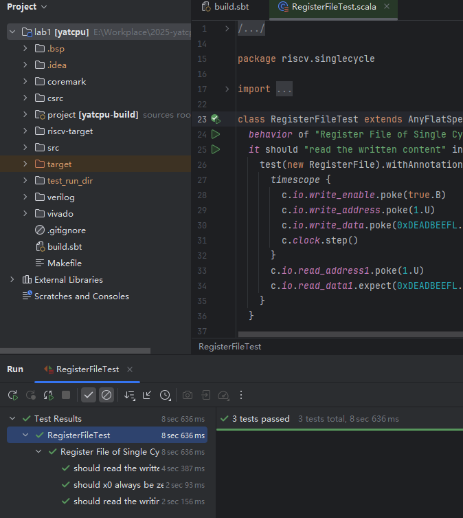

# Linux/WSL 配置指南

By: [:material-github: wu-kan](https://github.com/wu-kan)、[:material-github: howardlau1999](https://github.com/howardlau1999)


下面介绍如何在 Linux 或 WSL(Windows Subsystem for Linux) 环境中搭建本实验的开发环境。[这里](https://liuhaohua.com/server-programming-guide/appendix/build-env/)给出搭建相关环境的一个参照。

这里假设你使用的 Linux 或 WSL 系统是 Debian 11。对于使用其他 Linux 系统的同学，操作是类似的，相信你有足够的能力参考下面的指令搭建环境。

## 安装必要工具

本实验将会使用到以下工具，除 sbt 外，可以通过下面提供的命令一键安装：

```bash
sudo apt install -y git \
    clang \
    make \
    gnupg \
    scala \
    libtinfo5 \
    coreutils \
    cmake \
    llvm \
    lld 
```

| 名称                    | 说明                                 |
| :---------------------: | ------------------------------------ |
| git                     | 代码版本管理工具                     |
| clang, lld              | 用于编译生成 RISC-V 可执行二进制文件 |
| llvm                    | 用于编辑和查看二进制文件             |
| make                    | 用于执行 Makefile                    |
| cmake                   | 用于执行 CMakeLists.txt              |
| gnupg                   | 签名验证工具                         |
| scala                   | 本项目的语言编译器                   |
| sbt                     | Scala 包管理器                       |
| libtinfo5               | Vivado 启动依赖                      |
| md5sum                  | 安装包校验工具                       |

安装完成之后，在任意目录执行 `git clone --recursive https://github.com/PurplePower/2025-fall-yatcpu-repo` 下载代码仓库。

## 安装 sbt 包管理器

[sbt](https://www.scala-sbt.org/) 是 Scala 的构建系统及包管理器，可按照 [官方安装指示](https://www.scala-sbt.org/1.x/docs/zh-cn/Installing-sbt-on-Linux.html#Ubuntu%E5%92%8C%E5%85%B6%E4%BB%96%E5%9F%BA%E4%BA%8EDebian%E7%9A%84%E5%8F%91%E8%A1%8C%E7%89%88) 进行安装，该教程可能随着系统及版本更新而变化，以其官网为准。

```bash
echo "deb https://repo.scala-sbt.org/scalasbt/debian all main" | sudo tee /etc/apt/sources.list.d/sbt.list
echo "deb https://repo.scala-sbt.org/scalasbt/debian /" | sudo tee /etc/apt/sources.list.d/sbt_old.list
curl -sL "https://keyserver.ubuntu.com/pks/lookup?op=get&search=0x2EE0EA64E40A89B84B2DF73499E82A75642AC823" | sudo tee /etc/apt/trusted.gpg.d/sbt.asc
sudo apt-get update
sudo apt-get install sbt
# up to 2025-08-19
```


## 安装 Verilator

[Verilator](https://github.com/verilator/verilator) 是一款 Verilog 模拟器，在本实验中用于测试所编写的CPU及硬件，其模拟效率优于 Chisel3 自带模拟器。
chiseltest 测试会主动在 `PATH` 环境变量中寻找 Verilator 并使用。

使用 Verilator 推荐的安装方式，从源码安装：

```bash
cd $HOME
sudo apt-get install git perl python3 make autoconf g++ \
    flex bison ccache libgoogle-perftools-dev numactl perl-doc
git clone --depth 1 -b stable https://github.com/verilator/verilator
cd verilator
autoconf
./configure
make -j `nproc`
sudo make install
```

???+tips "修改安装路径"
    如果不想全局安装，可以在 `./configure` 后加参数 `--prefix=/path/to/install`，指定安装路径，且在后续测试时，需要将安装路径添加到 `PATH` 环境变量，以便测试程序可以找到 Verilator 可执行程序。

命令执行完毕后，可以执行命令 `verilator --version` 测试安装是否成功。同时应检查版本号为 4.xxx：

```
Verilator 4.219 devel rev UNKNOWN.REV (mod)
```

!!! warning "Verilator"
    由于代码仓库仍使用较旧的 [chiseltest](https://github.com/ucb-bar/chiseltest) 进行测试，其仅支持 Verilator 4.x 版本，而不兼容 5.x 版本。

    使用 `apt` 直接安装 Verilator 时将默认安装 5.x 版本。


之后，运行仿真测试的时候，测试框架将自动寻找 Verilator 并用来加速。配置完成后，可以用 VSCode 或者 vim 等编辑器打开代码仓库，开始实验了。


## 检验环境安装成功

如果您使用 IDEA 或 Vscode 远程连接到 Linux 上，那么可以打开 `lab1`并加载，vscode 需要手动点击右下角窗口 `Import build`。

在 IDEA 中 `双击` ++shift++ 打开 `RegisterFileTest.scala` ，应该能看见测试左侧的绿色箭头，点击运行如果能提示测试通过，则说明环境配置正确。

{width=80%}

如果您使用纯文本模式写码，您可以参考 [快速测试](../practice/chisel-test.md#快速测试) 教程，在终端中用命令测试。


---


## 安装 Vivado

!!! warning "预留足够的硬盘空间"
    Vivado 仅在最终烧板时使用，编写代码及测试不要求安装。您可完成实验后，准备烧板前再进行安装。若您电脑存储空间不足，也可询问助教使用无需 Vivado 和烧板的备用考核方式。

    Vivado 2020.1 安装包体积较大，约为 36 GB，且后续安装也要使用大量硬盘空间。请预留好**至少 100 GB 的硬盘空间**。

中山大学组成原理实验课使用的 Zynq 实验板型号为 Zybo-10， 需要 Xilinx 的工具进行综合实现以及烧板。这里安装 `Vitis` 即可，不需要许可或激活许可密钥。
经过测试且可用的 Vivado 版本为 2020.1 和 2022.1。更新或更旧的版本理论上可以使用，但没有经过测试。

经过测试且可用的 Vivado 版本为 2020.1 和 2022.1。更新或更旧的版本理论上可以使用，但没有经过测试。

中山大学校园网内下载 Vivado 2020.1 安装包，可以使用我们提供的镜像。
下面是使用 `curl` 下载校园网安装包镜像的命令，你也可以使用其他方式下载。

```bash
# 下载
curl -O https://mirrors.matrix.moe/software/Xilinx/Xilinx_Unified_2020.1_0602_1208.tar.gz
# 也可以在 Xilinx 的官网下载
# https://china.xilinx.com/support/download/index.html/content/xilinx/zh/downloadNav/vivado-design-tools/archive.html
```

由于文件较大，为了校验传输过程中是否发生错误，请在下载完成后验证安装包的 MD5 值。使用以下命令计算文件的 MD5 值：

```bash
md5sum Xilinx_Unified_2020.1_0602_1208.tar.gz
```

命令应当输出以下内容：

```bash
b018f7b331ab0446137756156ff944d9  Xilinx_Unified_2020.1_0602_1208.tar.gz
```

如果不一致，请重新下载。校验通过后，使用下面的命令解压安装包并生成安装配置文件：

```bash
tar -zxf Xilinx_Unified_2020.1_0602_1208.tar.gz
cd Xilinx_Unified_2020.1_0602_1208
./xsetup -b ConfigGen
```

输入 `1`，会产生一个默认配置文件 `~/.Xilinx/install_config.txt`。

随后再次执行下述指令，安装 `Vitis`。

```bash
./xsetup -a XilinxEULA,3rdPartyEULA,WebTalkTerms -b Install \
    -c ~/.Xilinx/install_config.txt -l ~/Xilinx
```

其中 `~/Xilinx` 是安装目录，可以自行定义。


<!-- ## 测试 Clang 编译器

`cd` 到仓库中的 `csrc` 目录，运行 `./build.sh` 脚本，一切正常的话应当看到如下输出：

```bash
~/chisel-riscv/csrc$ ./build.sh
-- The C compiler identification is Clang 11.0.1
-- The CXX compiler identification is Clang 11.0.1
-- The ASM compiler identification is Clang
-- Found assembler: /usr/bin/clang
-- Detecting C compiler ABI info
-- Detecting C compiler ABI info - done
-- Check for working C compiler: /usr/bin/clang - skipped
-- Detecting C compile features
-- Detecting C compile features - done
-- Detecting CXX compiler ABI info
-- Detecting CXX compiler ABI info - done
-- Check for working CXX compiler: /usr/bin/clang++ - skipped
-- Detecting CXX compile features
-- Detecting CXX compile features - done
-- Configuring done
-- Generating done
-- Build files have been written to: /mnt/c/Users/Liuhaohua/Desktop/chisel-riscv/csrc/build
Scanning dependencies of target prelude
[  7%] Building ASM object CMakeFiles/prelude.dir/init.S.obj
[ 14%] Linking ASM static library libprelude.a
[ 14%] Built target prelude
Scanning dependencies of target fibonacci
Scanning dependencies of target hello
Scanning dependencies of target mmio
Scanning dependencies of target quicksort
Scanning dependencies of target tetris
Scanning dependencies of target sb
[ 21%] Building ASM object CMakeFiles/mmio.dir/mmio.S.obj
[ 57%] Building C object CMakeFiles/quicksort.dir/quicksort.c.obj
[ 57%] Building ASM object CMakeFiles/sb.dir/sb.S.obj
[ 57%] Building C object CMakeFiles/tetris.dir/tetris.c.obj
[ 57%] Building C object CMakeFiles/fibonacci.dir/fibonacci.c.obj
[ 57%] Building C object CMakeFiles/hello.dir/hello.c.obj
[ 78%] Linking C executable quicksort
[ 78%] Linking C executable fibonacci
[ 78%] Linking C executable tetris
[100%] Linking ASM executable sb
[100%] Linking C executable hello
[100%] Linking ASM executable mmio
[100%] Built target quicksort
[100%] Built target tetris
[100%] Built target fibonacci
[100%] Built target sb
[100%] Built target mmio
[100%] Built target hello
``` -->


