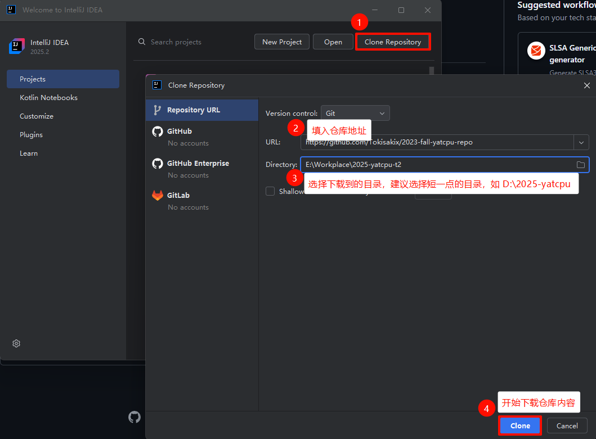
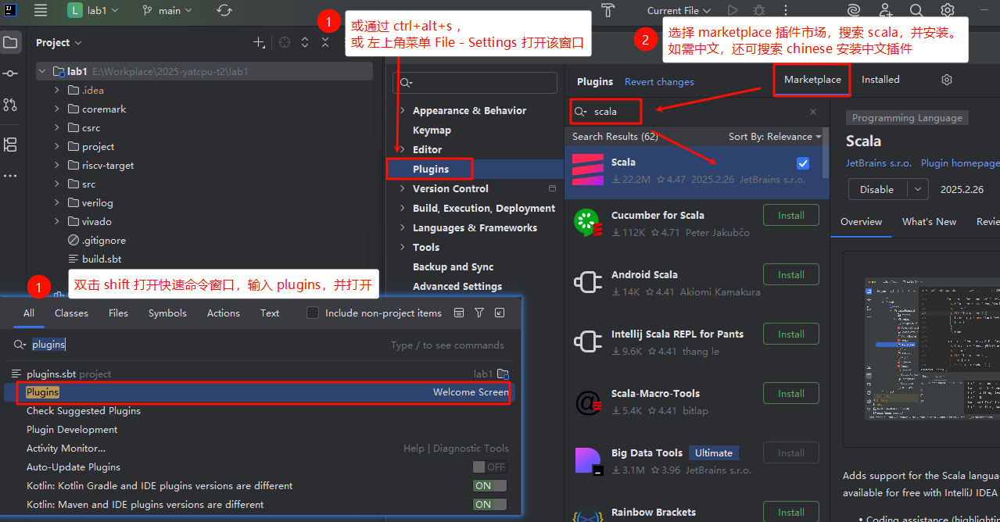
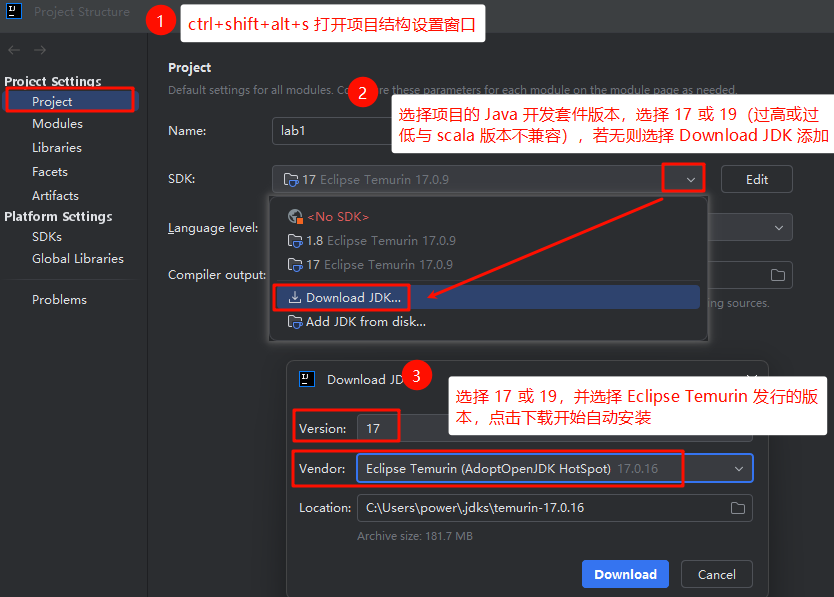
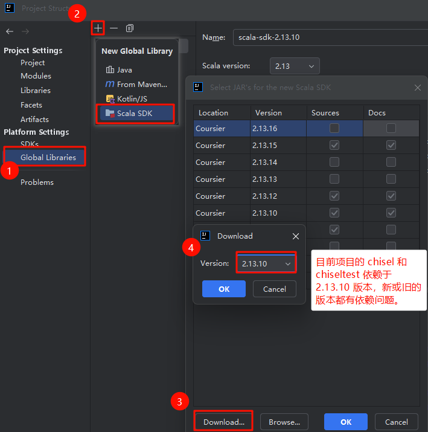
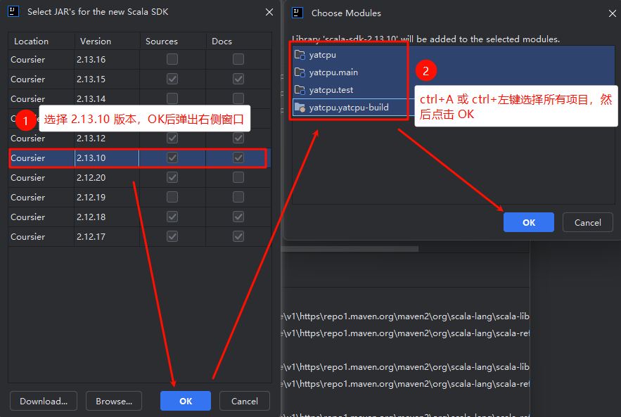
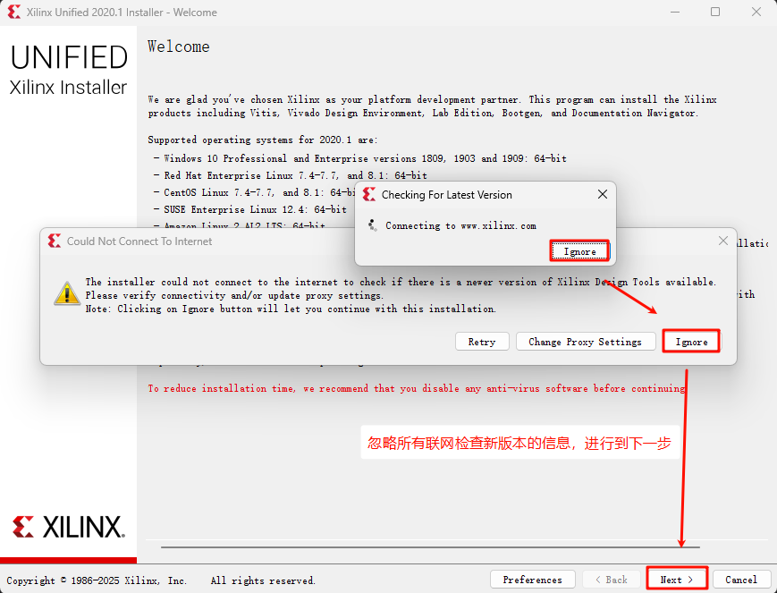
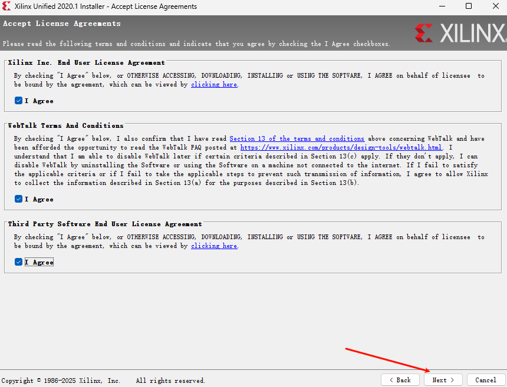
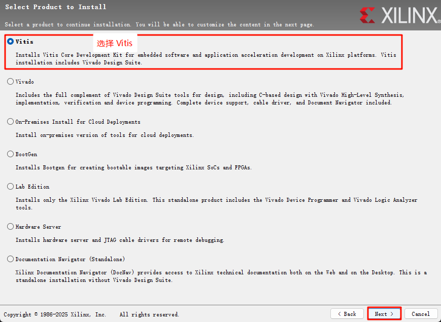
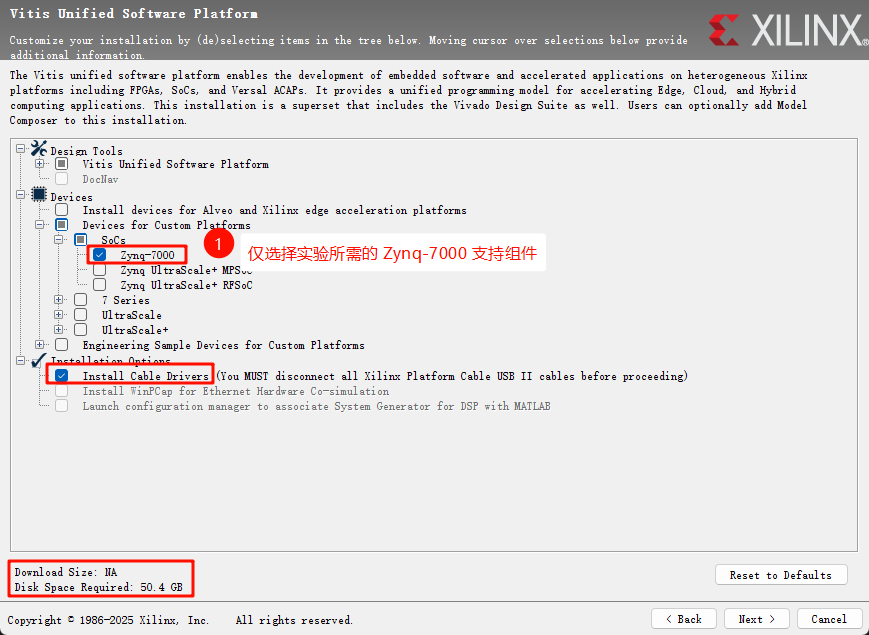
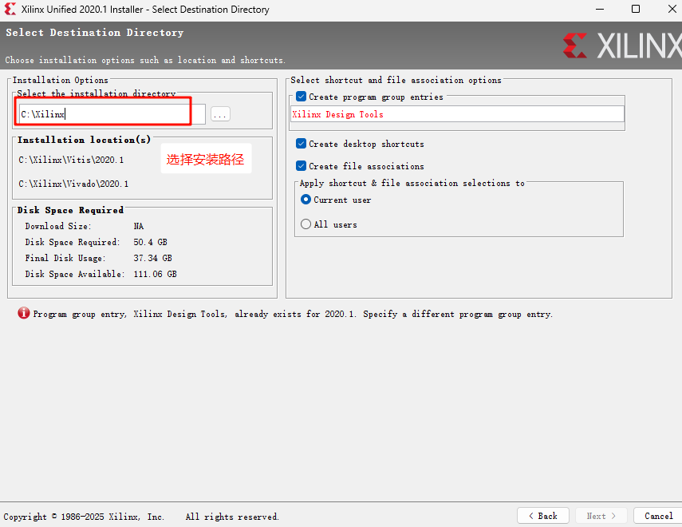

# Windows 配置指南

By: [:material-github: wu-kan](https://github.com/wu-kan)、[:material-github: howardlau1999](https://github.com/howardlau1999)

!!! tips "善于搜索问题及提问"
    TODO


## 安装 IDE

本实验可以使用 Jetbrains 的 IDEA 或 Microsoft 的 vscode 作为开发环境，您可从中**二选一**。
您将在这些IDE上完成代码并进行测试。

- IDEA 更容易上手，可以自动下载所需库，界面功能更清晰，但消耗内存较多 。
- vscode 有一定的上手难度，但熟悉后可以适用于各种编程语言和工程场景。


### 安装 Intellij IDEA


您可通过先安装 [Jetbrains Toolbox](https://www.jetbrains.com/toolbox-app/) 再从中下载 IDEA，也可在 [Intellij IDEA](https://www.jetbrains.com/idea/download/?section=windows) 处直接下载免费的 Community 版本(其他版本需收费且功能用不上)。


安装完成后打开，您应能看到欢迎界面，此时点击右上角的 Clone Repository 以克隆实验代码仓库，地址为 https://github.com/PurplePower/2025-fall-yatcpu-repo，并选择项目下载的文件夹，点击 clone 开始下载。
若由于网络问题克隆失败，可以重新尝试该步骤，或者直接去 GitHub 网页下载压缩包并解压。
下文均假设项目克隆至文件夹 `2025-fall-yatcpu-repo` 。



稍等片刻后，项目将被打开，此时会提示是否信任该仓库，选择 Trust Project。您可以在左侧文件浏览器一览整个仓库的结构，包括各个实验的项目文件夹 `labx` 。目前我们是将 `2025-fall-yatcpu-repo` 文件夹作为根目录（root），当进行后续实验时，需要以对应实验的 `labx` 作为根目录。如下图，在左上角 File - Close Project 关闭当前项目，并重新打开 `2025-fall-yatcpu-repo` 下面的 `lab1` 。


随后，您需要安装 Scala 插件。 `双击 `++shift++ 调出快速命令窗口，输入 plugins 并打开插件管理窗口；或通过 ++ctrl+shift+s++ ，或 File - Settings 打开，随后在 marketplace 搜索 scala 插件并安装，如需中文还可搜索 Chinese Language Pack 以使界面汉化。如下图所示。



启用 Scala 插件后，右下角可能弹出窗口提示 load/import sbt build，选择 import 加载项目。
随后需安装 JDK 及 Scala 库。使用 ++ctrl+shift+alt+s++ 或 `双击` ++shift++ 并打开 Project Structure 窗口，首先在 Project 侧栏中配置 SDK 中的 JDK ，若您电脑已安装有 JDK 17 或 19，直接选择即可。若无，则下载 Java 17 或 19 的 Eclipse Temurin 版本。



随后侧栏中选择 Global Libraries，点击➕添加 Scala SDK ，注意选择 2.13.10 版本，等待下载完成。若遇到网络问题，可以重新操作下载。下载完成后，添加其为使用 Scala SDK。如下面两图所示。






### 选项2：安装 Visual Studio Code

使用 vscode 需要手动安装 JDK、Scala，并设置相应系统环境变量，仅建议有相应经验或想要探索的同学使用。若希望快速上手项目开始写码，安装 IDEA 后即可进行后面的配置。


??? note "安装 vscode"

    !!! warning "😦别搞混 vscode 和 vs"
        虽然都是微软公司的软件，但 Visial Studio（VS）专为 Windows 上的 C++、C# 开发设计，而 Visual Studio Code（vscode）则更具普适性，适合各种系统的各种编程语言的开发。

    在 [](https://code.visualstudio.com/download) 处下载适合的版本，一般为 Windows x64 版本。vscode 运行 scala 依赖于 Metals 这款插件，配置教程可看：[极客教程](https://geek-docs.com/scala/scala-questions/475_scala_how_to_run_an_existing_scala_project_using_vs_code_and_metals.html) 和 [Metals官方文档](https://scalameta.org/metals/docs/editors/vscode) 。


    参照 [Using the Scala Installer (recommended way)](https://docs.scala-lang.org/getting-started/index.html#using-the-scala-installer-recommended-way) ，在页面处下载 Coursier 工具，并跟随指引安装。Coursier 会自动安装 JDK 和 sbt 。

    完成这两项后，打开 vscode，打开 `lab1` 作为根目录。注意 vscode 右下角提示 "Import project" 时，点击导入项目，即可加载。

---

## 安装 MSYS2 和 Verilator


[Verilator](https://github.com/verilator/verilator) 是一款 Verilog 模拟器，在本实验中用于测试所编写的CPU及硬件，其模拟效率优于 Chisel3 自带模拟器。
chiseltest 测试会主动在 `PATH` 环境变量中寻找 Verilator 并使用。

首先 [下载 MSYS2](https://www.msys2.org/)，执行安装并将安装目录下的两个文件夹添加至系统 `PATH` 变量，例如您将其安装至 `D:\msys64`，则应添加：

- `D:\msys64\usr\bin`
- `D:\msys64\mingw64\bin`

在开始菜单搜索“环境变量”，打开“编辑系统环境变量”，在弹出的对话框点击“环境变量”，双击用户变量中的“Path”，点击“新建”，在最后添加上述路径。
添加系统变量 `PATH` 的教程见 [path-环境变量及其修改](../practice/envvar-and-cmd.md#path-环境变量及其修改) 。

随后，使用 ++win+r++ 运行 `cmd` 打开命令行窗口，输入 

```cmd
D:\msys64\usr\bin\bash
```


，进入到 MSYS2 提供的 bash 窗口（注意，若您电脑安装有 WSL，直接输入 `bash` 可能进入的不是 MSYS2 的 bash）。随后，依次输入下列指令，并观察输出是否有 error, failed 等报错：


```bash
# 安装所需包，若网络不好安装失败，则重新执行
pacman -Sy --noconfirm --needed base-devel mingw-w64-x86_64-toolchain git flex mingw-w64-x86_64-cmake mingw-w64-x86_64-autotools mingw-w64-x86_64-python3 

# 临时设置 PATH 包含 core perl
export PATH=/mingw64/bin:/usr/local/bin:/usr/bin:/usr/bin/core_perl:$PATH   

# 切换到 ~ 用户目录，并查看当前路径
cd /home/$USER; pwd

# 克隆到 ~/verilator，如果您已克隆或复制了包，请略过
git clone --depth 1 -b v4.226 https://github.com/verilator/verilator;	
```

!!!warning "Windows 和 Unix 路径分隔符的区别"
    MSYS 是在 Windows 上提供了一个兼容 Linux 的环境，在 Linux 里输入的路径应使用 `/` 作为目录分隔符， `\` 会被识别为反义字符（如`\n`换行）。而 Windows 上两种斜杠都可以作为分隔符。


???tips "克隆 Verilator 失败时"

    若 `git clone` 时网络不佳导致失败，可以重试或在 [Verilator 4.226 Release](https://github.com/verilator/verilator/archive/refs/tags/v4.226.zip) 下载压缩包，并解压到相应目录：

    - 若 `pwd` 显示 `/c/Users/<用户名>` ，则对应 Windows C盘里 `Users/<用户名>/verilator` 文件夹
    - 若 `pwd` 显示 `/home/<用户名>`，则对应 MSYS 安装目录里的文件夹，如 `D:\msys64\home\<用户名>\verilator`

之后，按下面的步骤构建并安装 Verilator：


```bash
# 进入verilator文件夹
cd ~/verilator  

# 设置 shell 编码，避免安装错误
export LC_ALL=en_US.UTF-8; export LANG=en_US.UTF-8  

# 如果成功不会有任何输出
autoconf  

# verilator 自动设置，需要等待一段时间
./configure --prefix=/mingw64  


# 进行编译安装
cp /usr/include/FlexLexer.h /mingw64/include;
make -j$(nproc); make install    

```

完成上述步骤后，在 `bash` 输入下述指令，若成功输出版本号 4.226 则为成功。

```bash
verilator_bin --version
# 若成功会输出 Verilator 4.226 2022-08-31 rev v4.226
```

## 检验环境安装成功

完成 IDEA / Vscode，以及 Verilator 的安装后， `lab1` 项目应该能被正确加载，在 IDEA 中 `双击` ++shift++ 打开 `RegisterFileTest.scala` ，应该能看见测试左侧的绿色箭头，点击运行如果能提示测试通过，则说明环境配置正确。

{width=80%}


---

## 安装 Vivado

!!! warning "预留足够的硬盘空间"
    Vivado 仅在最终烧板时使用，编写代码及测试不要求安装。您可完成实验后，准备烧板前再进行安装。若您电脑存储空间不足，也可询问助教使用无需 Vivado 和烧板的备用考核方式。

    Vivado 2020.1 安装包体积较大，约为 36 GB，且后续安装也要使用大量硬盘空间。请预留好**至少 100 GB 的硬盘空间**。


中山大学组成原理实验课使用的 Zynq 实验板型号为 Zybo-10， 需要 Xilinx 的工具进行综合实现以及烧板。这里安装 `Vitis` 即可，不需要许可或激活许可密钥。
经过测试且可用的 Vivado 版本为 2020.1 和 2022.1。更新或更旧的版本理论上可以使用，但没有经过测试。

安装包体积较大，**推荐使用带断点续传功能的下载工具如迅雷、Free Download Manager 下载**。

如果你在**中山大学校园网内**下载 Vivado 2020.1 安装包，可以使用我们提供的镜像：[点此下载](https://mirrors.matrix.moe/software/Xilinx/Xilinx_Unified_2020.1_0602_1208.tar.gz)。

也可以在 Xilinx 的官网下载（可能需要注册AMD账户）：[点击跳转](https://china.xilinx.com/support/download/index.html/content/xilinx/zh/downloadNav/vivado-design-tools/archive.html)。







之后耐心等待安装完成即可，这可能耗时数分钟。
